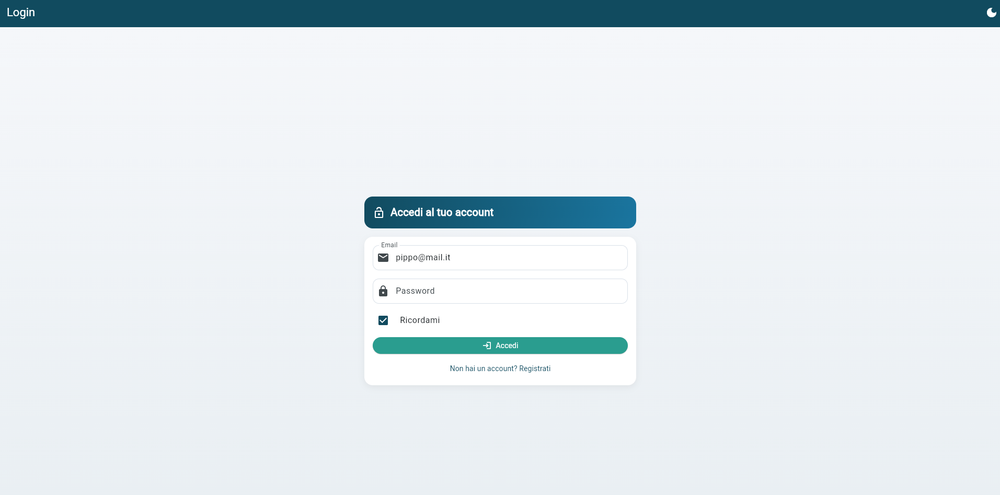
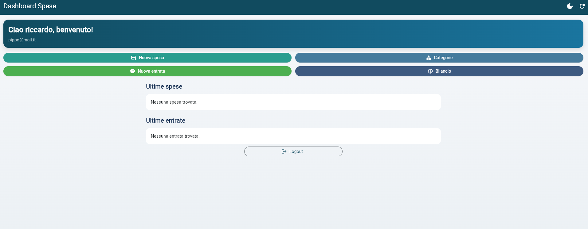
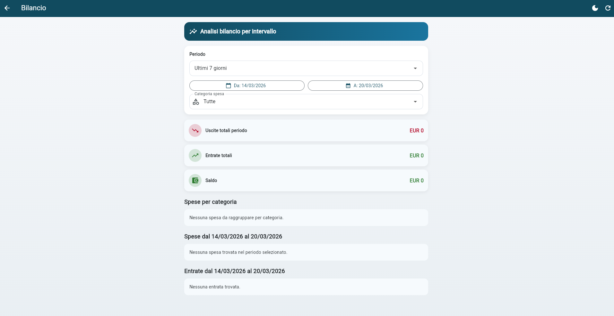

# App Finanza

Applicazione per la gestione della finanza personale, pensata per tenere traccia in modo semplice di spese, entrate e categorie.

Il progetto e diviso in due parti:
- un'app Flutter (interfaccia utente)
- un backend Node.js/Express (API + persistenza su MySQL)

## A cosa serve

App Finanza nasce per risolvere un problema pratico: annotare velocemente le spese quotidiane e avere una vista ordinata delle ultime uscite.

In particolare permette di:
- creare un account ed effettuare login
- definire categorie personalizzate (es. Spesa, Trasporti, Tempo libero)
- registrare una spesa con nome, data, prezzo e categoria
- registrare un'entrata con nome e prezzo
- visualizzare ultime spese e ultime entrate salvate

Obiettivo: avere un diario economico minimale, chiaro e facilmente estendibile.

## Funzionalita principali

- Registrazione utente con email univoca (username anche duplicabile)
- Login con verifica password hashata
- Gestione catalogo categorie
- Inserimento spese con validazioni lato backend
- Inserimento entrate con validazioni lato backend
- Lettura lista spese ordinate per data decrescente
- Lettura lista entrate ordinate per id decrescente
- Endpoint health check per verificare che il server sia operativo

## Screenshot

### Login



### Home / Spese



### Bilancio



## Architettura

### Frontend (Flutter)

Il frontend si occupa di:
- autenticazione utente
- form di inserimento categorie, spese e entrate
- visualizzazione dati nella home
- gestione tema (chiaro/scuro)

La comunicazione avviene via HTTP JSON tramite il servizio in [flutter_application_1/lib/db_service.dart](flutter_application_1/lib/db_service.dart).

### Backend (Node.js + Express)

Il backend espone API REST e gestisce:
- validazione input
- accesso al database MySQL
- hashing password con `bcryptjs`
- transazioni nelle operazioni critiche (es. inserimento spesa)

Entry point: [backend/server.js](backend/server.js).

### Database (MySQL)

Schema logico minimo:
- `user`: credenziali utente
- `categorie`: elenco categorie personalizzate
- `spese`: movimenti di spesa associati a una categoria
- `entrate`: movimenti di entrata

## Stack tecnologico

- Flutter / Dart (SDK `^3.11.1`)
- Node.js + Express
- MySQL
- `mysql2/promise`, `bcryptjs`, `dotenv`, `cors`

## Struttura progetto

```text
app-finanza/
  backend/
    package.json
    server.js
    .env.example
  flutter_application_1/
    lib/
    pubspec.yaml
```

## Flusso utente (end-to-end)

1. L'utente crea account dalla schermata di registrazione.
2. Effettua login con `email` e password.
3. Inserisce una o piu categorie personali.
4. Registra le spese selezionando categoria e data.
5. Registra eventuali entrate.
6. Nella home vede ultime spese e ultime entrate.

## Setup rapido

### Prerequisiti

- Flutter SDK installato
- Node.js 18+
- MySQL 8+ (o compatibile)

### 1) Backend

```bash
cd backend
npm install
```

Crea `.env` copiando [backend/.env.example](backend/.env.example):

```env
DATABASE_HOST=localhost
DATABASE_PORT=3306
DATABASE_USER=root
DATABASE_PASSWORD=password
DATABASE_NAME=finanzadb
PORT=3002
```

Nota: in [flutter_application_1/lib/db_service.dart](flutter_application_1/lib/db_service.dart) l'API base e `http://localhost:3002/api`, quindi `PORT` deve essere `3002` (oppure aggiorna il base URL lato Flutter).

Nota piattaforme:
- Web/Desktop: `http://localhost:3002/api`
- Android emulator: `http://10.0.2.2:3002/api`

### 2) Database

Esegui questo script SQL:

```sql
CREATE DATABASE IF NOT EXISTS finanzadb;
USE finanzadb;

CREATE TABLE IF NOT EXISTS user (
  mail VARCHAR(255) PRIMARY KEY,
  userId VARCHAR(100) NOT NULL,
  password VARCHAR(255) NOT NULL
);

CREATE TABLE IF NOT EXISTS categorie (
  idcategoria INT AUTO_INCREMENT PRIMARY KEY,
  nome VARCHAR(100) NOT NULL,
  mail VARCHAR(255) NOT NULL,
  INDEX idx_categorie_mail (mail),
  UNIQUE KEY uq_categorie_mail_nome (mail, nome),
  CONSTRAINT fk_categorie_user_mail
    FOREIGN KEY (mail) REFERENCES user(mail)
    ON UPDATE CASCADE
    ON DELETE RESTRICT
);

CREATE TABLE IF NOT EXISTS spese (
  idspese INT AUTO_INCREMENT PRIMARY KEY,
  nome VARCHAR(255) NOT NULL,
  giorno DATE NOT NULL,
  prezzo INT NOT NULL,
  idcategoria INT NOT NULL,
  mail VARCHAR(255) NOT NULL,
  INDEX idx_spese_mail (mail),
  CONSTRAINT fk_spese_categoria
    FOREIGN KEY (idcategoria) REFERENCES categorie(idcategoria)
    ON UPDATE CASCADE
    ON DELETE RESTRICT,
  CONSTRAINT fk_spese_user_mail
    FOREIGN KEY (mail) REFERENCES user(mail)
    ON UPDATE CASCADE
    ON DELETE RESTRICT
);

CREATE TABLE IF NOT EXISTS entrate (
  identrate INT AUTO_INCREMENT PRIMARY KEY,
  nome VARCHAR(45) NOT NULL,
  prezzo INT NOT NULL,
  data DATE NOT NULL,
  mail VARCHAR(255) NOT NULL,
  INDEX idx_entrate_mail (mail),
  CONSTRAINT fk_entrate_user_mail
    FOREIGN KEY (mail) REFERENCES user(mail)
    ON UPDATE CASCADE
    ON DELETE RESTRICT
);
```

Nota: il backend non esegue migrazioni automatiche dello schema all'avvio. Assicurati che il DB sia gia allineato prima del deploy.

### 3) Avvio servizi

Metodo consigliato (dalla root del repository, avvio parallelo backend + Flutter):

```powershell
.\run_flutter_clean_and_start.ps1 -Device chrome
```

Se PowerShell blocca lo script (ExecutionPolicy), usa:

```powershell
powershell -NoProfile -ExecutionPolicy Bypass -File .\run_flutter_clean_and_start.ps1 -Device chrome
```

Parametri script:
- `-FlutterProjectPath` (default: `flutter_application_1`)
- `-SkipPubGet` (switch)
- `-Device` (default: `chrome`, supporta anche `emulator` o un id device Flutter)
- `-ApiBaseUrl` (opzionale: se valorizzato usa API remota e non avvia il backend locale)

Esempi:

```powershell
.\run_flutter_clean_and_start.ps1
.\run_flutter_clean_and_start.ps1 -SkipPubGet
.\run_flutter_clean_and_start.ps1 -Device emulator
.\run_flutter_clean_and_start.ps1 -Device windows
.\run_flutter_clean_and_start.ps1 -Device chrome -ApiBaseUrl "https://app-finanza.onrender.com/api"
```

Nota importante su `-ApiBaseUrl`:
- non passare il parametro vuoto (es. `-ApiBaseUrl` senza valore)
- se non ti serve API remota, ometti proprio il parametro

### Avvio con DB in rete

Hai due modalita possibili:

1. Backend gia online (collegato al DB remoto)

Usa API remote e avvia solo Flutter:

```powershell
powershell -NoProfile -ExecutionPolicy Bypass -File .\run_flutter_clean_and_start.ps1 -Device chrome -ApiBaseUrl "https://app-finanza.onrender.com/api"
```

2. Backend locale + DB remoto (Aiven/PlanetScale)

Imposta le variabili DB remote nel file `backend/.env`, poi avvia senza `-ApiBaseUrl`:

```powershell
powershell -NoProfile -ExecutionPolicy Bypass -File .\run_flutter_clean_and_start.ps1 -Device chrome
```

Nota: se scrivi `-ApiBaseUrl` senza valore, lo script termina con errore.

Avvio manuale (alternativa):

Avvia backend:

```bash
cd backend
npm run dev
```

Avvia frontend:

```bash
cd flutter_application_1
flutter pub get
flutter run -d chrome
```

## API disponibili

- `POST /api/register`
- `POST /api/login`
- `POST /api/categorie`
- `GET /api/categorie`
- `POST /api/spese`
- `GET /api/spese?limit=10`
- `POST /api/entrate`
- `GET /api/entrate?limit=10`
- `GET /api/health`
- `GET /api/health/db`

## Test rapido API live (Render)

Per verificare che il backend in produzione sia davvero operativo (health + DB + CRUD base), usa lo script PowerShell [test_live_api.ps1](test_live_api.ps1).

Esempio:

```powershell
powershell -NoProfile -ExecutionPolicy Bypass -File .\test_live_api.ps1 -BaseUrl "https://app-finanza.onrender.com/"
```

Parametri utili:
- `-BaseUrl` (obbligatorio): URL base del backend (con o senza `/api`)
- `-TestUserId`, `-TestEmail`, `-TestPassword`: override dati utente test
- `-SkipCleanup`: non cancella record di test creati
- `-TimeoutSec`: timeout chiamate HTTP

Interpretazione risultato:
- Se passa solo `/api/health` ma gli altri endpoint vanno in `500`, il servizio e online ma la connessione DB in produzione non e configurata correttamente.
- Se fallisce anche `/api/health`, il problema e sul deployment/app runtime (non sul DB).

## Sicurezza e validazioni

- Password mai salvate in chiaro: vengono hashate con `bcryptjs`.
- Password non persistite in chiaro lato app (viene salvata solo email se "ricordami" attivo).
- Controlli backend su campi obbligatori e formato dati (es. data e prezzo).
- Pool di connessioni MySQL con rilascio sicuro delle connessioni.
- In produzione usare HTTPS per proteggere le credenziali in transito.

## Troubleshooting

- `npm run dev` fallisce:
  verifica `npm install`, file `.env` e credenziali DB.
- Flutter non raggiunge il backend:
  verifica che porta backend e `_baseUrl` coincidano.
- `Cannot GET /api/entrate` o risposta HTML 404:
  backend non aggiornato o istanza vecchia ancora attiva; riavvia backend e riprova.
- Errori login/registrazione:
  controlla che le tabelle esistano e che il DB sia raggiungibile.
- CORS o rete su browser:
  assicurati che il backend sia avviato prima del frontend.
- Su Render `/api/health` risponde ma le altre API tornano `500`:
  verifica variabili ambiente `DATABASE_HOST`, `DATABASE_PORT`, `DATABASE_USER`, `DATABASE_PASSWORD`, `DATABASE_NAME`.
- Se usi PlanetScale o DB managed con TLS:
  imposta `DATABASE_SSL=true`; se richiesto dal provider, aggiungi CA con `DATABASE_SSL_CA_BASE64` (consigliato) o `DATABASE_SSL_CA`.
- Se ricevi `self-signed certificate in certificate chain`:
  configura la CA del provider e mantieni `DATABASE_SSL_REJECT_UNAUTHORIZED=true`; usa `false` solo come test temporaneo.
- Dopo modifica env vars su Render:
  esegui un redeploy/restart del servizio e ripeti lo smoke test.

## Possibili evoluzioni

- filtro spese per periodo/categoria
- grafici mensili e report
- budget mensile con alert superamento
- gestione multiutente completa con token/JWT
